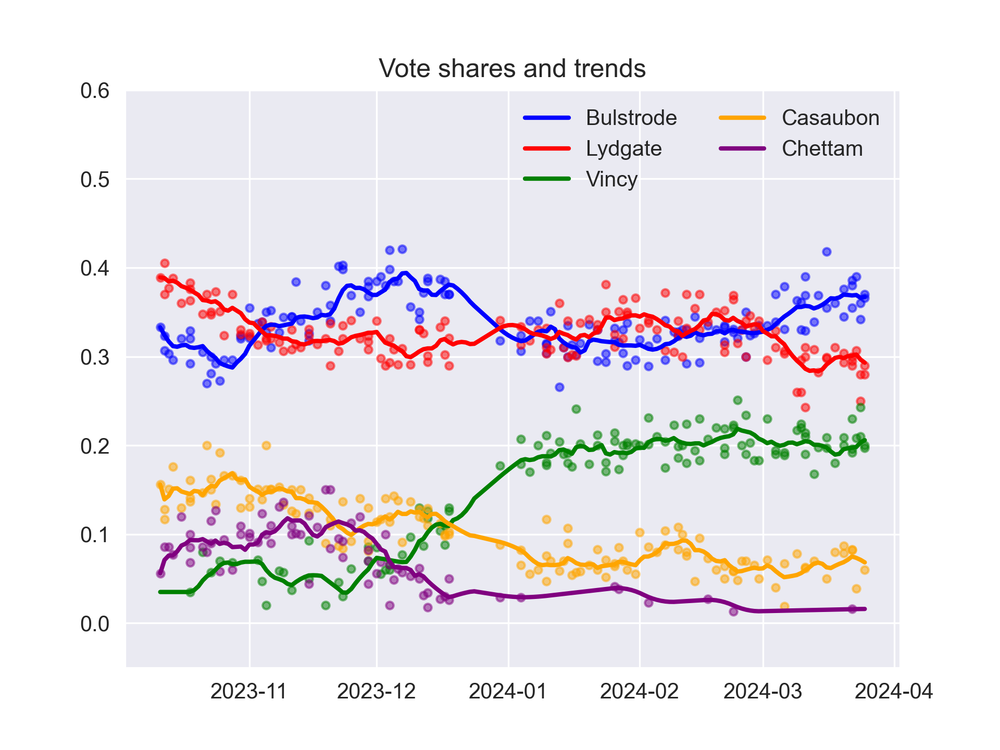

# poll-tracker-assignment

## Overview
This repo contains a script to scrape, clean and aggregate poll data from this [url](https://cdn-dev.economistdatateam.com/jobs/pds/code-test/index.html). The main script is `scrape_polls.py` which loads functions defined in `tools_scrape_polls.py` to perform the individual steps of the analysis. The outputs are two csv files: `polls.csv` and `trends.csv`. 

## Preliminaries

### Running the script

The main script can be run from the command line without any parameters. It relies on only a few external packages to scrape the url (`requests`, `bs4`) as well as `pandas` (version 1.2.0!) for data handling. These need to be installed in a virtual environment prior to execution. 

To create the virtual environment and install the necessary packages, run the following commands (depending on the operating system):

Linux/macOS(?)
```
virtualenv venv # assumes that virtualenv is installed and added to path
source venv/bin/activate
pip install -r requirements.txt
```
Windows
```
virtualenv venv # assumes that virtualenv is installed and added to path
venv\Scripts\activate
pip install -r requirements.txt
```
Examples: WSL, Raspbian 

### Logging and error handling

The script uses Python's `logging` module to log messages to file. These include `INFO` messages whenever a section of the code has been completed successfully. 

When polls are removed because of data irregularities (see below), a `WARNING` is written to the log file. Non-expected warnings are also re-routed to the log file rather than the console. 

Each code section is excecuted in a try and except block and any exceptions including tracebacks are written as `ERROR` to the log file. The execution of the script is then interrupted to avoid follow-on errors.

Only the result of the execution - success or error - is printed to the console with a reminder to check the log file for details. 


## Short description of the script sections

### Scrape url 


### Parse and transform data

#### Dealing with data irregularities

The script should be able to convert most string formats for the vote shares to floats (e.g. `30`, `30.6`, `30,6`, `30.6%` or typos like `30.6$`). However, when this is not possible the script does not raise an exception. Instead it sets all vote shares to `NaN` and in a subsequent step, all such polls are dropped from the analysis and a warning issued. 

The script also checks if the vote shares (approximately) sum to 1 to catch potential data entry errors. An example is the poll by on November 18th, 2023 where the reported vote share for Bulstrode suddenly jumps to over 0.6. The sum of vote shares for this poll is well over 1 suggesting a data entry error. Such polls are removed and a warning issued.

### Calculate trends

I calculate the trend as a **7-day moving average** of the reported vote share. To deal with days where there are no observations I first **linearly interpolate** the missing values. 

With polling data up to March 25, 2024 the trends for the five candidates look like this:



### Export to csv

The results are written in to csv files in the present working directory. In line with the example files provided, the trends (polls) are in (reverse) chronological order. 


## To do

- ~~reverse order for polls (latest polls first)~~
- ~~change column names before saving to csv~~
- ~~function to export data to csv~~
- ~~try date-based rolling average, i.e. 7-day window not 7 observations~~
- ~~scrape footnotes as well~~
- ~~deal with footnotes in polls~~
- ~~check if shares sum to 1, else remove~~
- ~~check if outliers are present -> Bulstrode mid November~~ (dealt with because vote shares do not sum to 1)
- ~~add logging in each "section" of the code with try and except (see [here](https://medium.com/@rahulkumar_33287/logger-error-versus-logger-exception-4113b39beb4b)) -> important to include stack traceback~~
- ~~move functions like loading data, calculating trends etc. to separate file~~
- ~~move calc of df_rawdata from parse_data() to scrape_table()~~
- ~~consider repeating values rather than interpolating -> this may be more appropriate when there is a longer break in polling, e.g. during the two-week holiday period in the summer~~
- ~~separate script to generate graph plot_trends.png -> currently still in dev script~~
- ~~virtualenv~~
- ~~docstring~~
- ~~check that trend has only one obs per day -> resample('1D') method~~
- ~~inclusive filter when converting shares to numeric~~
- ~~handle warnings in logger -> currently written to console!~~
- html tests
- short docu of steps in README
- ~~only keep packages necessary for running scraper in requirements.txt, i.e. no matplotlib and jupyter~~
- pandas has to be version 1.2.0!
- ~~adjust message when aborting script~~
- ~~remove option pad for trend~~
- figure of sum of shares
- test virtualenv on windows and linux
- remove df_data_removed et al. from script
- ~~rename plot function~~


